# 🎯 FINAL COMPREHENSIVE SYSTEM FLOWCHART
## Professional Accounting System - Complete Architecture

---

## 📊 SYSTEM OVERVIEW FLOWCHART

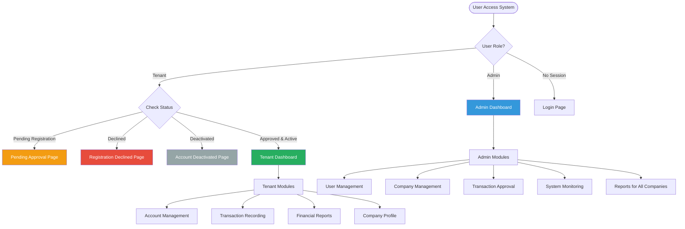

---

## 🔐 AUTHENTICATION & AUTHORIZATION FLOW

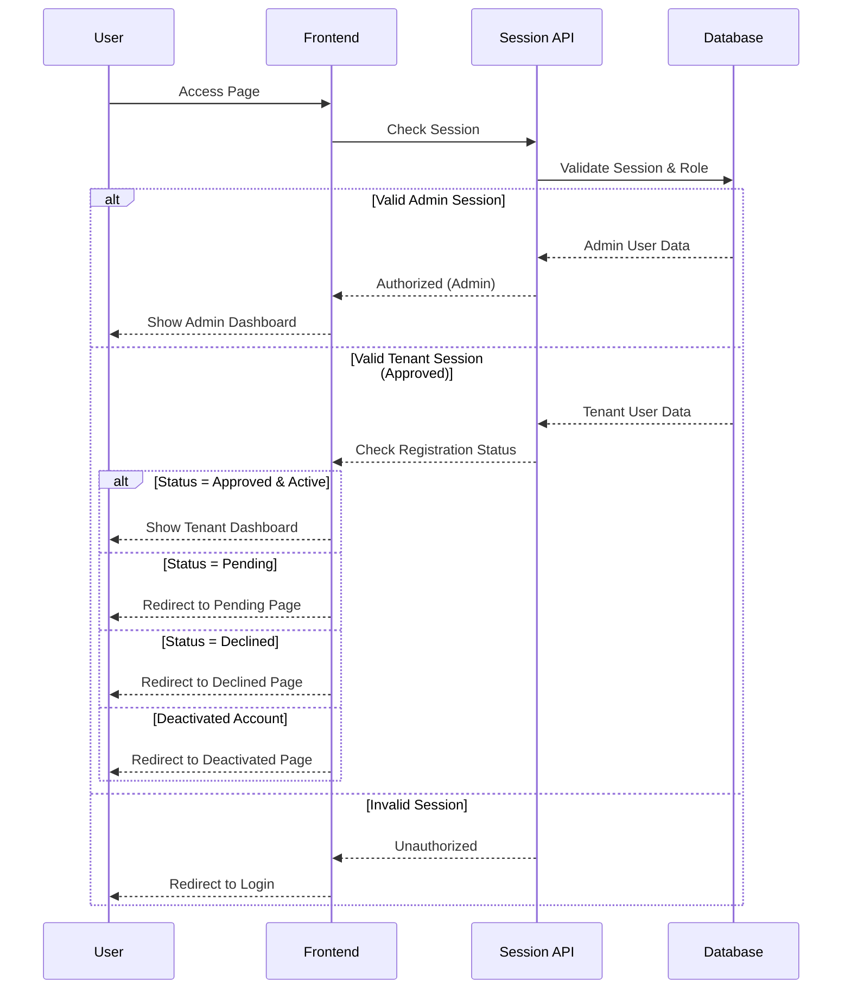

---

## 📝 USER REGISTRATION WORKFLOW

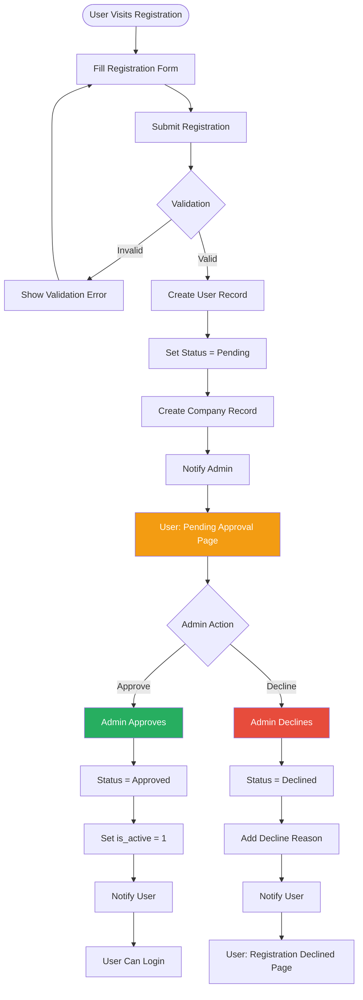

---

## 💰 ACCOUNT CREATION FLOW

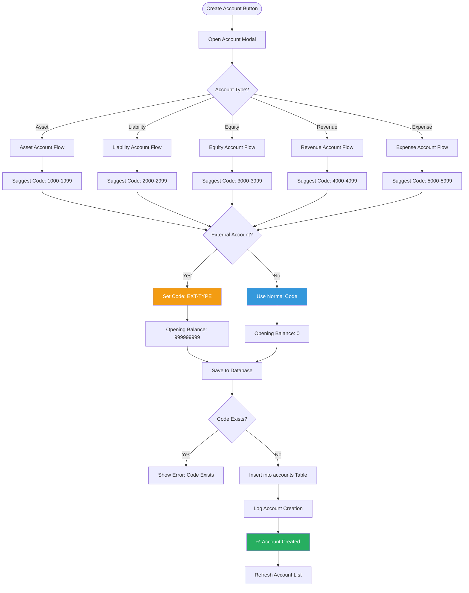

---

## 📊 DOUBLE-ENTRY TRANSACTION FLOW

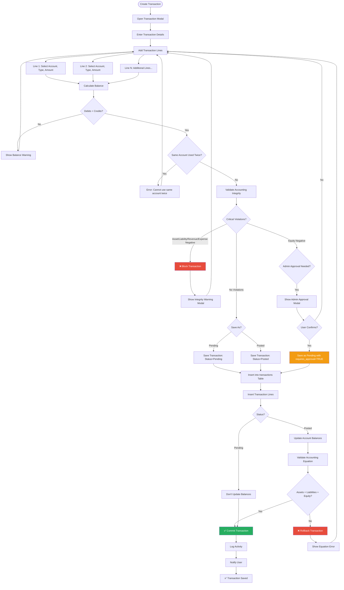

---

## ✅ ADMIN APPROVAL WORKFLOW

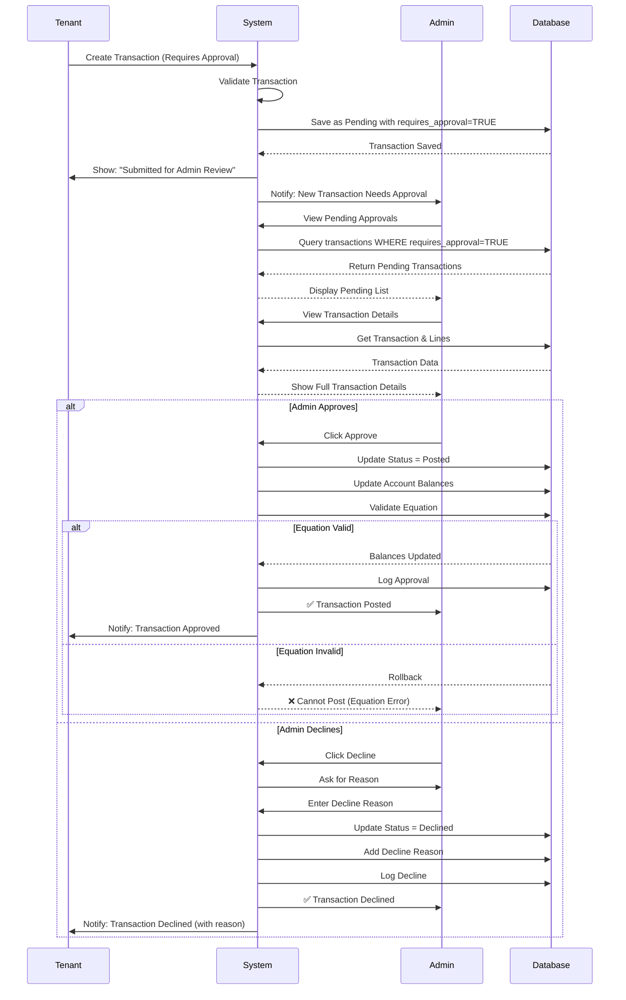

---

## 🔄 VOID TRANSACTION FLOW

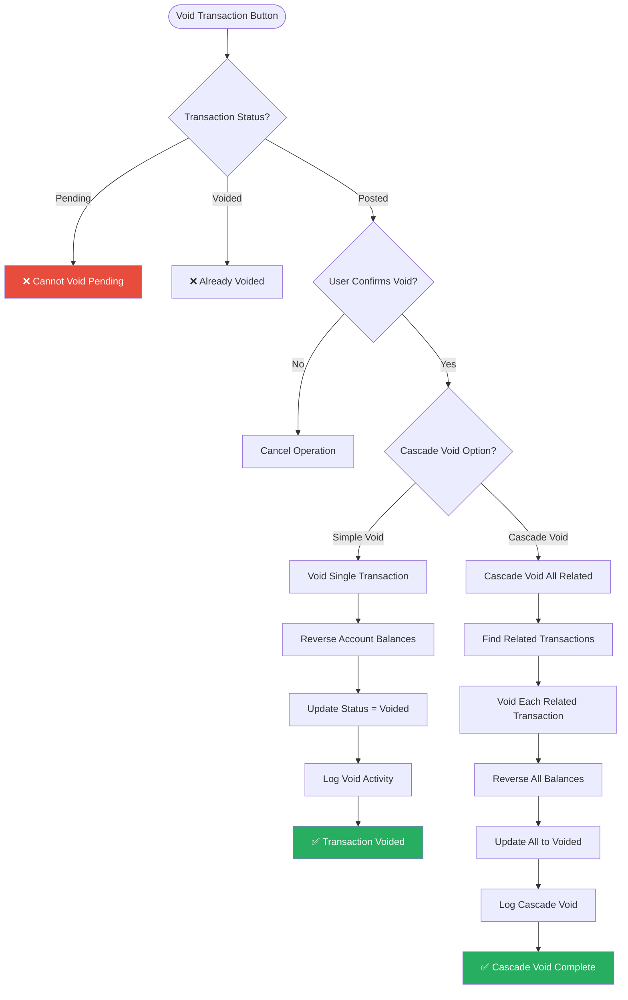

---

## 📈 FINANCIAL REPORTS GENERATION

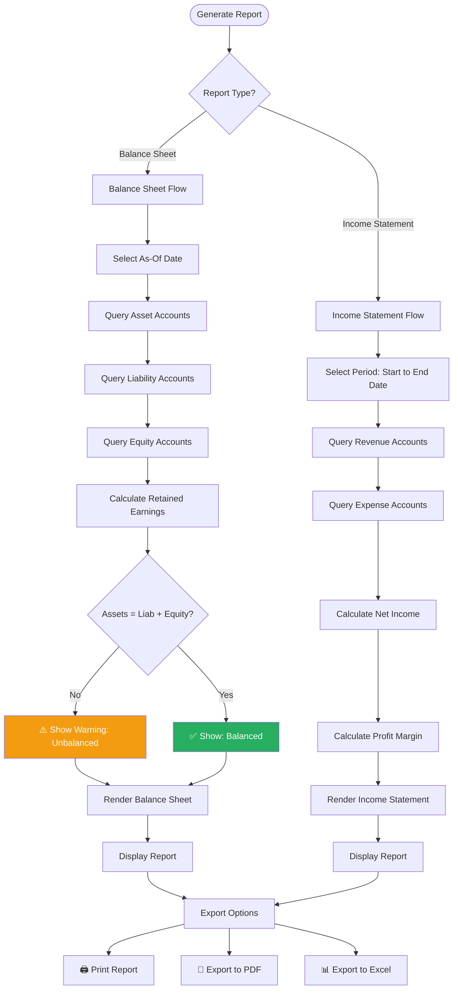

---

## 🗄️ DATABASE STRUCTURE FLOW

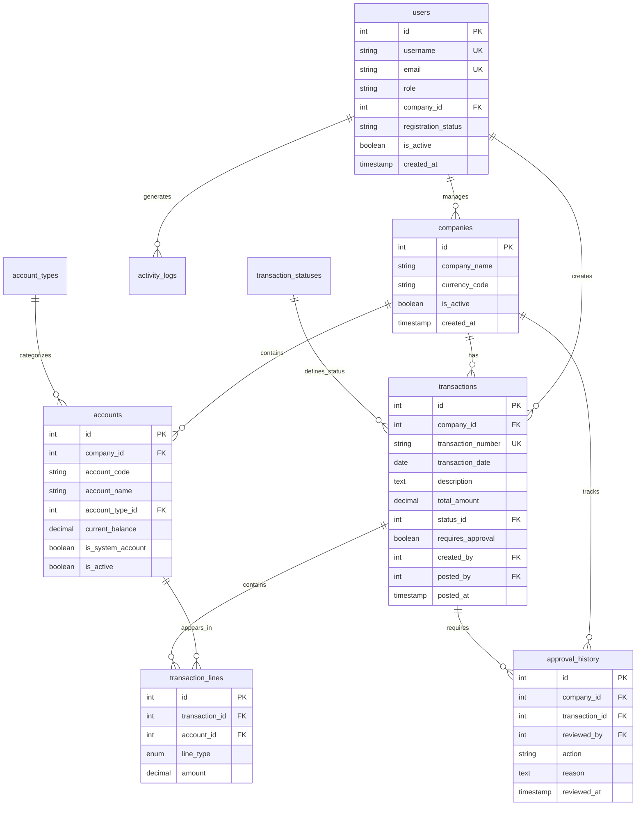

---

## 🔒 ACCOUNTING INTEGRITY VALIDATION FLOW

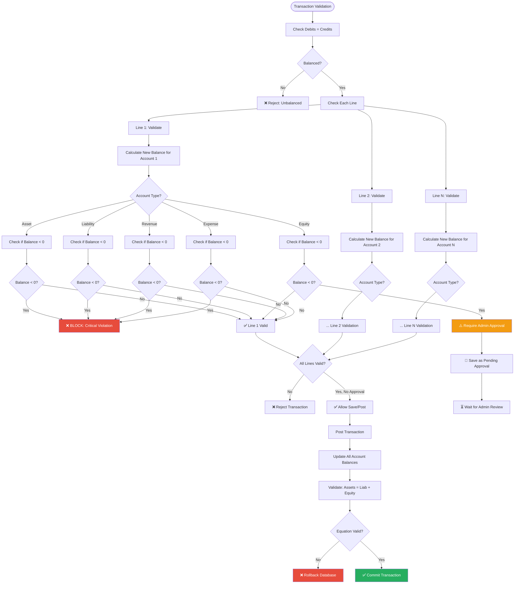

---

## 🎨 USER INTERFACE FLOW

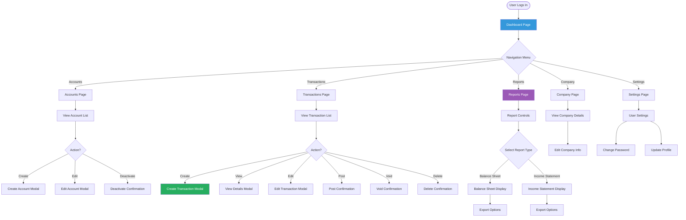

---

## 🚀 SYSTEM STARTUP & INITIALIZATION

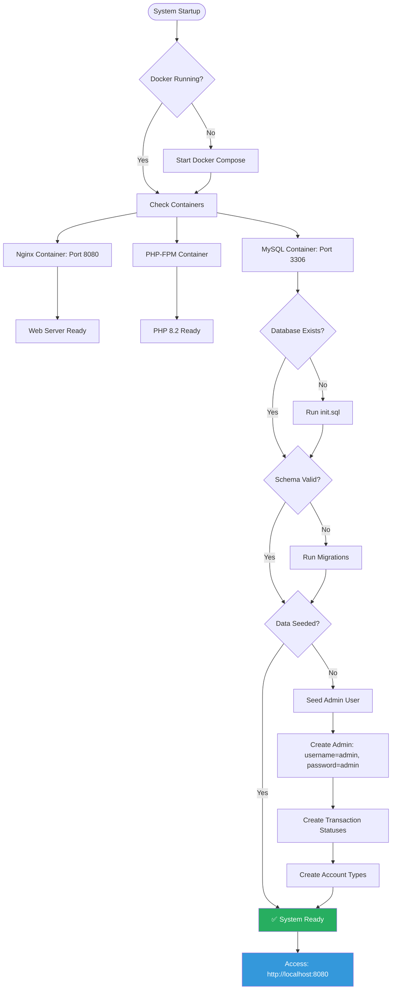

---

## 📋 COMPLETE FEATURE MAP

### Admin Features
- ✅ User Management (Approve/Decline Registrations)
- ✅ Company Management (View/Edit/Activate/Deactivate)
- ✅ Transaction Approval System
- ✅ Global Transaction Monitoring
- ✅ Cross-Company Reports
- ✅ Activity Log Monitoring
- ✅ System Statistics Dashboard
- ✅ Account Management (All Companies)

### Tenant Features
- ✅ Account Creation (Normal & External)
- ✅ Double-Entry Transaction Recording
- ✅ Transaction Management (Pending/Posted)
- ✅ Financial Reports (Balance Sheet, Income Statement)
- ✅ Company Profile Management
- ✅ User Settings & Profile
- ✅ Activity History

### System Features
- ✅ Double-Entry Bookkeeping Validation
- ✅ Accounting Equation Enforcement
- ✅ Negative Balance Prevention
- ✅ Admin Approval Workflow (Rare Scenarios)
- ✅ External Source Account Simulation
- ✅ Transaction Void & Cascade
- ✅ Audit Trail & Activity Logs
- ✅ Role-Based Access Control
- ✅ Session Management
- ✅ Real-Time Notifications

---

## 🎯 KEY SYSTEM RULES

### Accounting Principles Enforced
1. **Debits Must Equal Credits** - Every transaction must balance
2. **Assets = Liabilities + Equity** - Equation must hold after every transaction
3. **No Negative Balances** - Assets, Liabilities, Revenue, Expenses cannot go negative
4. **Equity Can Go Negative** - But requires admin approval (rare scenario)
5. **Posted Transactions are Immutable** - Can only be voided, not edited or deleted
6. **Void Creates Reversal** - All account balances are reversed
7. **Double-Entry Required** - Minimum 2 lines per transaction
8. **External Accounts Unlimited** - Simulate outside world with unlimited balance

### User Rules
1. **Admin can do everything** - Full system access
2. **Tenant can only access their company** - Multi-tenant isolation
3. **Pending registration users cannot access system** - Must be approved
4. **Declined users cannot re-register** - Must contact admin
5. **Deactivated users cannot login** - Account suspended
6. **Session expires on inactivity** - Security measure

### Transaction Rules
1. **Pending transactions can be edited/deleted** - Draft mode
2. **Posted transactions are permanent** - Locked forever
3. **Voided transactions show in history** - Audit trail
4. **Same account cannot be used twice** - Prevents confusion
5. **Admin approval required for rare scenarios** - Negative equity
6. **Balance validation happens on save** - Real-time check

---

## 📊 SYSTEM METRICS

- **Total Database Tables**: 12
- **Total API Endpoints**: 50+
- **User Roles**: 2 (Admin, Tenant)
- **Account Types**: 5 (Asset, Liability, Equity, Revenue, Expense)
- **Transaction Statuses**: 3 (Pending, Posted, Voided)
- **Registration Statuses**: 3 (Pending, Approved, Declined)

---

## 🎓 ACCOUNTING EDUCATION FEATURES

The system includes comprehensive educational materials:

- **Accounting Rules Documentation** (`/docs/accounting-rules.html`)
- **External World Simulator Guide** (`/external-world-simulator.html`)
- **Interactive Help in Transaction Forms**
- **Real-time Balance Impact Indicators**
- **Contextual Warnings & Information**
- **Professional Error Messages with Explanations**

---

## ✨ CONCLUSION

This comprehensive flowchart covers the entire system architecture, from user registration to financial reporting. The system enforces strict accounting principles while providing flexibility for complex scenarios through admin approval workflows.

**Built with:** PHP 8.2, MySQL 8.0, Nginx, Docker, Vanilla JavaScript
**Architecture:** Multi-tenant, Role-based Access Control, RESTful API
**Accounting:** Double-Entry Bookkeeping, GAAP Compliant

---

**Document Version:** 1.0  
**Last Updated:** November 17, 2025  
**System Status:** ✅ Production Ready

