# 🎨 COMPLETE SYSTEM VISUALIZATION
## Accounting System - Use Case Diagram, ERD, and Flow Charts

**Generated**: November 18, 2025  
**Version**: 1.0 - Complete System Analysis

---

## 📋 TABLE OF CONTENTS

1. [Use Case Diagram](#-use-case-diagram)
2. [Entity Relationship Diagram (ERD)](#-entity-relationship-diagram-erd)
3. [System Flow Charts](#-system-flow-charts)
   - Authentication Flow
   - Transaction Processing Flow
   - Registration & Approval Flow
   - Company & Tenant Management Flow
4. [Sequence Diagrams](#-sequence-diagrams)
5. [System Architecture](#-system-architecture)

---

## 🎯 USE CASE DIAGRAM

```mermaid
graph TB
    subgraph "External Actors"
        Admin[👤 Administrator]
        Tenant[👤 Tenant User]
        Guest[👤 Guest/Visitor]
    end
    
    subgraph "Accounting System"
        subgraph "Authentication & Registration"
            UC1[Login to System]
            UC2[Register New Account]
            UC3[Logout]
            UC4[Change Password]
        end
        
        subgraph "Admin Functions"
            UC5[Manage Companies]
            UC6[Approve/Decline Registration]
            UC7[Manage Tenants]
            UC8[Activate/Deactivate Tenants]
            UC9[View All Transactions]
            UC10[Approve/Decline Transactions]
            UC11[Void Transactions]
            UC12[View Activity Logs]
            UC13[Export Reports CSV]
            UC14[View System Statistics]
            UC15[Manage System Accounts]
        end
        
        subgraph "Tenant Functions"
            UC16[View Dashboard]
            UC17[Manage Chart of Accounts]
            UC18[Create Transaction]
            UC19[Update Transaction]
            UC20[Delete Transaction]
            UC21[Post Transaction]
            UC22[View Balance Sheet]
            UC23[View Income Statement]
            UC24[Manage Company Profile]
            UC25[View Transaction History]
        end
        
        subgraph "Common Functions"
            UC26[Update Profile]
            UC27[View Notifications]
            UC28[Check Account Balance]
        end
    end
    
    %% Admin Relationships
    Admin --> UC1
    Admin --> UC3
    Admin --> UC4
    Admin --> UC5
    Admin --> UC6
    Admin --> UC7
    Admin --> UC8
    Admin --> UC9
    Admin --> UC10
    Admin --> UC11
    Admin --> UC12
    Admin --> UC13
    Admin --> UC14
    Admin --> UC15
    Admin --> UC26
    Admin --> UC27
    
    %% Tenant Relationships
    Tenant --> UC1
    Tenant --> UC3
    Tenant --> UC4
    Tenant --> UC16
    Tenant --> UC17
    Tenant --> UC18
    Tenant --> UC19
    Tenant --> UC20
    Tenant --> UC21
    Tenant --> UC22
    Tenant --> UC23
    Tenant --> UC24
    Tenant --> UC25
    Tenant --> UC26
    Tenant --> UC27
    Tenant --> UC28
    
    %% Guest Relationships
    Guest --> UC2
    Guest --> UC1
    
    %% Include/Extend Relationships
    UC18 -.->|includes| UC28
    UC19 -.->|includes| UC28
    UC21 -.->|includes| UC28
    UC6 -.->|extends| UC7
    UC10 -.->|extends| UC9
    
    style Admin fill:#3498db,stroke:#2980b9,color:#fff
    style Tenant fill:#27ae60,stroke:#229954,color:#fff
    style Guest fill:#95a5a6,stroke:#7f8c8d,color:#fff
```

---

## 📊 ENTITY RELATIONSHIP DIAGRAM (ERD)

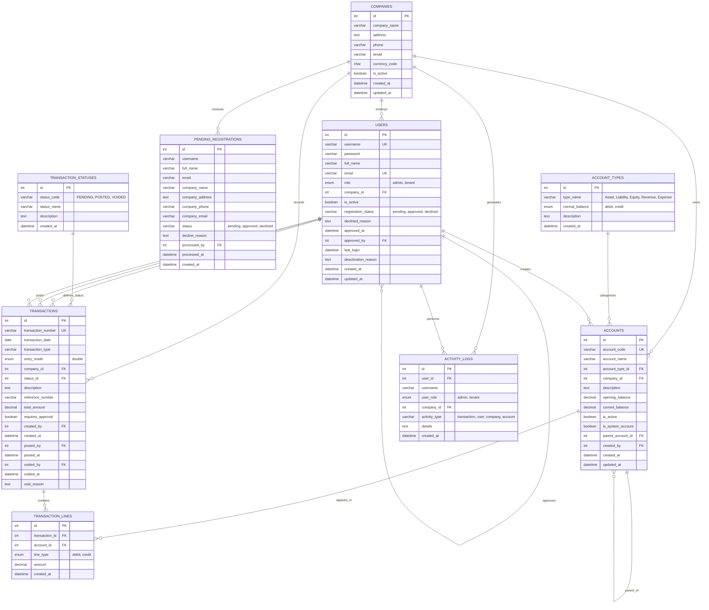

---

## 🔄 SYSTEM FLOW CHARTS

### 1. AUTHENTICATION FLOW

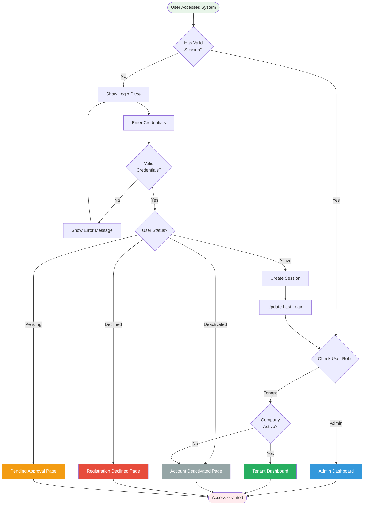

---

### 2. TRANSACTION PROCESSING FLOW

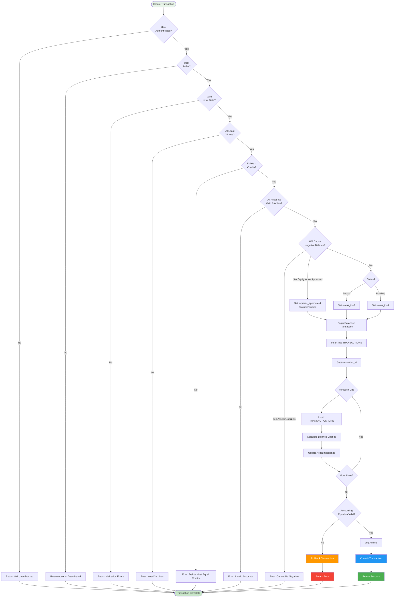

---

### 3. REGISTRATION & APPROVAL FLOW

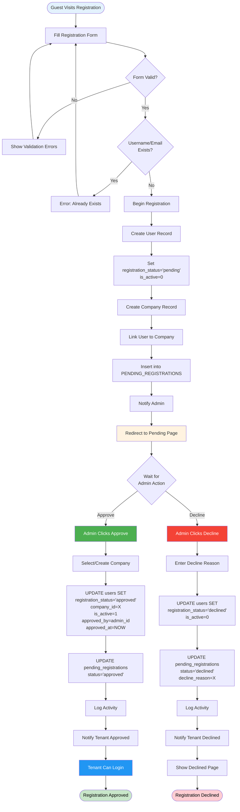

---

### 4. COMPANY & TENANT MANAGEMENT FLOW

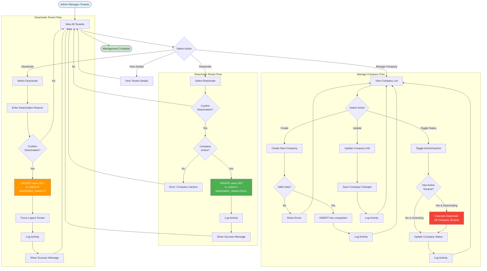

---

## 🔁 SEQUENCE DIAGRAMS

### Transaction Creation Sequence

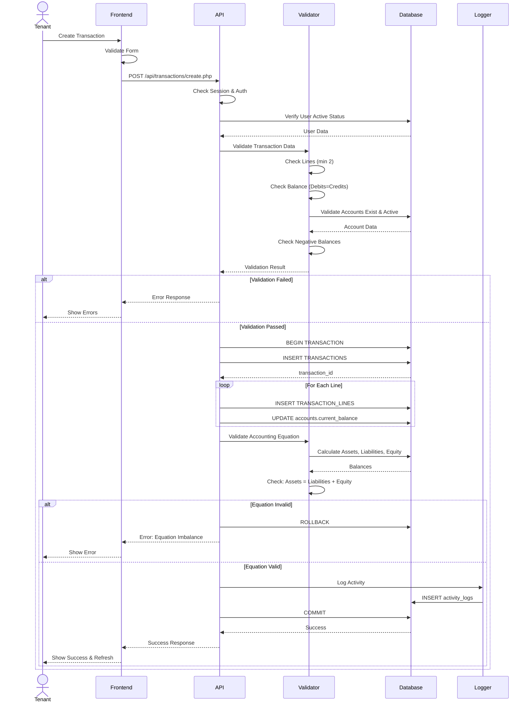

---

### Admin Approval Sequence

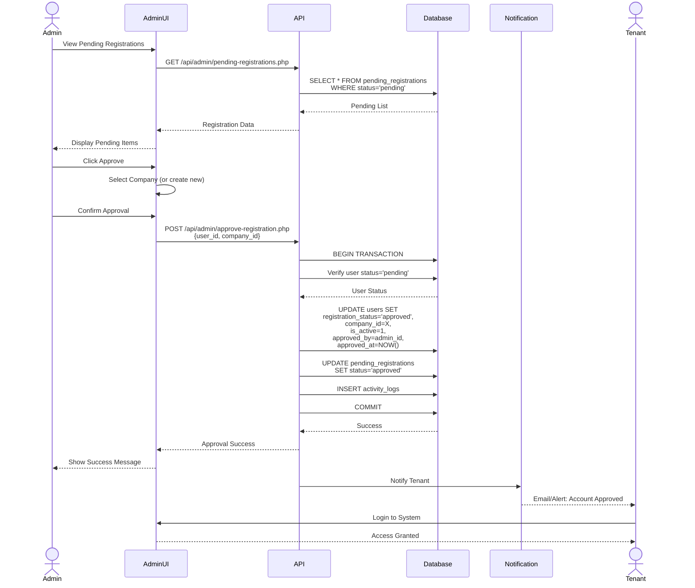

---

## 🏗️ SYSTEM ARCHITECTURE

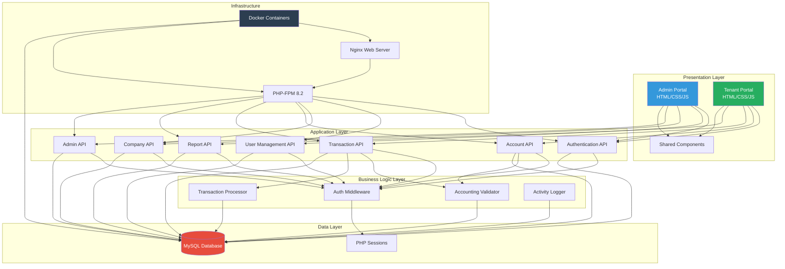

---

## 📊 DATA FLOW DIAGRAM

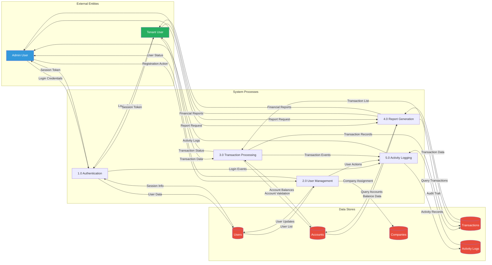

---

## 🎯 COMPONENT DIAGRAM

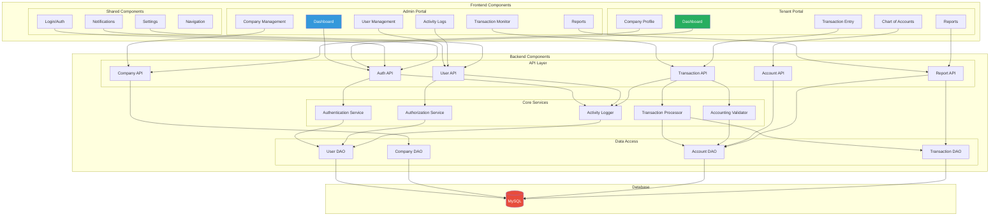

---

## 📝 SYSTEM SUMMARY

### Key Features Overview

| Feature | Admin | Tenant | Description |
|---------|-------|--------|-------------|
| **Authentication** | ✅ | ✅ | Login/Logout with role-based access |
| **User Management** | ✅ | ❌ | Create, approve, deactivate users |
| **Company Management** | ✅ | View Only | CRUD operations on companies |
| **Chart of Accounts** | ✅ | ✅ | Manage account hierarchy |
| **Transaction Entry** | ✅ | ✅ | Double-entry bookkeeping |
| **Transaction Approval** | ✅ | ❌ | Approve/decline special transactions |
| **Transaction Voiding** | ✅ | ❌ | Void posted transactions |
| **Financial Reports** | ✅ | ✅ | Balance Sheet, Income Statement |
| **Activity Logs** | ✅ | ❌ | Audit trail of all actions |
| **Dashboard** | ✅ | ✅ | Real-time statistics and charts |

---

### Technical Stack

- **Frontend**: HTML5, CSS3, JavaScript (Vanilla)
- **Backend**: PHP 8.2
- **Database**: MySQL 8.0
- **Web Server**: Nginx
- **Container**: Docker & Docker Compose
- **Architecture**: MVC Pattern
- **Security**: Session-based authentication, Role-based access control

---

### Accounting Rules Enforced

1. **Double-Entry Bookkeeping**: Every transaction must have equal debits and credits
2. **Accounting Equation**: Assets = Liabilities + Equity (always balanced)
3. **Account Types**: Asset, Liability, Equity, Revenue, Expense
4. **Normal Balances**: Enforced for each account type
5. **Negative Balance Prevention**: Assets and Liabilities cannot go negative
6. **Transaction Immutability**: Posted transactions cannot be edited (only voided)
7. **Audit Trail**: All actions are logged for accountability

---

## 📞 CONTACT & SUPPORT

For questions or issues, please refer to:
- **README.md** - System setup and overview
- **COMPLETE_ACCOUNTING_IMPLEMENTATION.md** - Detailed accounting logic
- **FINAL-ERD-COMPREHENSIVE.md** - Database schema details

---

**Document Version**: 1.0  
**Last Updated**: November 18, 2025  
**System Status**: ✅ Production Ready

