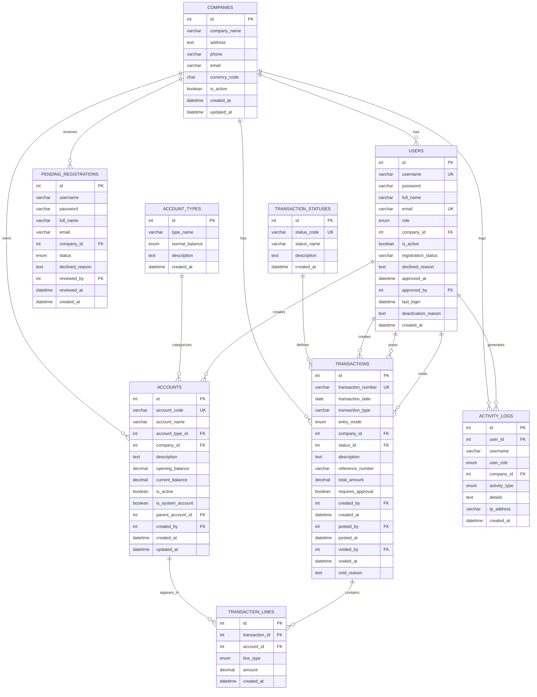

# 🎨 VISUAL ERD DIAGRAM - Accounting System

## Database Schema Visualization

## Legend

- **PK** = Primary Key
- **FK** = Foreign Key
- **UK** = Unique Key
- **||--o{** = One-to-Many relationship
- **Enum** = Predefined set of values

## Color Coding (for visual tools)

- 🔵 **Blue** = Core business entities (Companies, Accounts, Transactions)
- 🟢 **Green** = Reference/System tables (Account Types, Transaction Statuses)
- 🟡 **Yellow** = User management (Users, Pending Registrations)
- 🟣 **Purple** = Transaction details (Transaction Lines)
- 🟠 **Orange** = Audit/Logging (Activity Logs)

---

**Status**: Production Ready ✅  
**Date**: November 17, 2025

